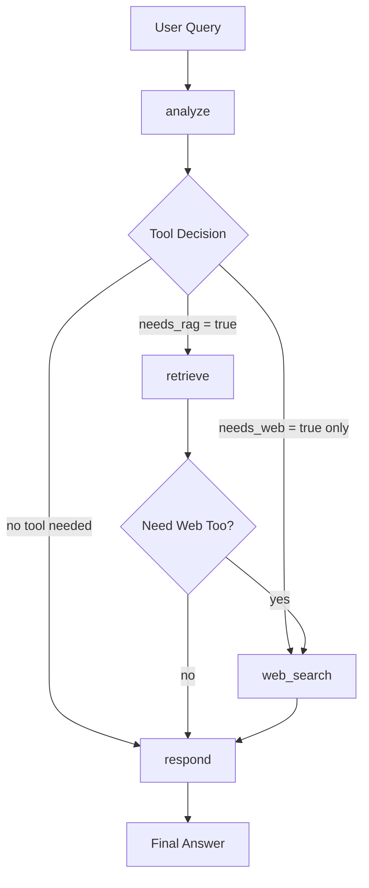

# University Course Selection Assistant

**Agentic AI System Technical Report**

**Authors:** Batuhan Akbasak, Mehmet Ali Yetimoglu, Onur Kaan Sen  
**Project Type:** Two-week Agentic AI Project  
**Core Technologies:** LangGraph, LangChain, RAG, Web Search, GitHub Models  

---

## 1. Executive Summary

The University Course Selection Assistant is an agentic AI system designed to help computer engineering students make better academic decisions. The assistant answers questions about course prerequisites, course content, credits, elective planning, graduation requirements, and career-oriented course choices.

The system combines a local university course knowledge base with live web search. This makes it useful for both stable institutional information, such as course prerequisites, and dynamic external information, such as current technology versions or salary trends.

The project satisfies the four required technical components:

| Requirement | Implementation |
|---|---|
| LangGraph | A `StateGraph` with four nodes and conditional routing |
| LangChain | LLM calls, message abstractions, embeddings, and vector store integration |
| RAG | 17 local documents ingested into ChromaDB and retrieved at query time |
| Web Search | DuckDuckGo-based search tool selected autonomously by the agent |

---

## 2. Problem Definition

University students often struggle to decide which courses to take and in what order. Course catalogs contain useful information, but students still need to connect prerequisites, credits, elective options, and career goals. Some questions also require current information that a static course catalog cannot provide.

Examples:

- "What are the prerequisites for the Machine Learning course?"
- "Which math courses should I complete before taking Deep Learning?"
- "What is the latest PyTorch version?"
- "Which courses should I choose if I want to become an AI engineer?"

This project addresses the problem by building an agent that can decide whether a question should be answered from local university documents, live web search, or both.

---

## 3. System Overview

The assistant is implemented as a command-line application. A user enters a question, and the agent analyzes it before selecting tools. The system is intentionally scoped as a reliable CLI assistant rather than a custom UI, which matches the project instructions.

### Main Capabilities

- Course prerequisite lookup
- Course content explanation
- Credit and semester information
- Elective planning guidance
- Graduation requirement support
- Career-oriented course recommendations
- Current technology and salary lookup through web search
- English and Turkish answer support based on the user's question language

### Project Structure

```text
university-course/
├── agent.py              # LangGraph agent and tool logic
├── main.py               # Command-line interface
├── ingest.py             # RAG ingestion script
├── requirements.txt      # Python dependencies
├── .env.example          # Environment variable template
├── AI_USAGE.md           # AI assistance disclosure
├── TECHNICAL_REPORT.md   # This report
├── VIDEO_GUIDE.md        # Demo video plan
├── corpus/               # 17 local knowledge base documents
└── chroma_db/            # Local ChromaDB vector store
```

---

## 4. Architecture

The agent is built as a LangGraph state machine. It does not always follow the same path. Instead, it branches based on the user's query.



### LangGraph Nodes

| Node | Responsibility |
|---|---|
| `analyze` | Determines whether the query needs RAG, web search, both, or neither |
| `retrieve` | Retrieves relevant course information from ChromaDB |
| `web_search` | Searches the web for current external information |
| `respond` | Generates the final answer using all gathered context |

### State Fields

The agent keeps track of the query and tool results using a typed state:

```python
class AgentState(TypedDict):
    query: str
    messages: Annotated[list, operator.add]
    retrieved_docs: str
    web_results: str
    needs_rag: bool
    needs_web: bool
    rag_done: bool
    web_done: bool
    response: str
```

This state allows the graph to branch and remember which tools have already been used.

---

## 5. LangGraph Design

The graph uses conditional edges to make the agentic behavior visible and testable. The `analyze` node is the decision point. It asks the LLM to return a strict JSON decision:

```json
{
  "use_rag": true,
  "use_web": false,
  "reason": "Prerequisites are university-specific information."
}
```

The routing logic then maps the state to the next node:

- If `needs_rag` is true, the graph moves to `retrieve`.
- If only `needs_web` is true, it moves directly to `web_search`.
- If neither tool is needed, it moves to `respond`.
- After RAG, the graph may still continue to web search if the query also needs current information.

This satisfies the project requirement for a `StateGraph` with branching control flow.

---

## 6. LangChain and LLM Integration

LangChain is used to structure LLM calls and connect the model to the rest of the application.

### Main LangChain Components

| Component | Usage |
|---|---|
| `ChatOpenAI` | Connects to GitHub Models through an OpenAI-compatible API |
| `SystemMessage` | Defines the assistant's role and behavior |
| `HumanMessage` | Passes the user's query to the model |
| `AIMessage` | Stores the final assistant response |
| `HuggingFaceEmbeddings` | Converts text chunks into vectors |
| `Chroma` | Retrieves semantically similar document chunks |

The project uses GitHub Models as the primary LLM provider:

```env
GITHUB_MODEL=openai/gpt-4.1
```

The API key is loaded from `.env`, and `.env` is excluded from Git to avoid committing secrets.

---

## 7. RAG Pipeline

RAG is used for local, stable, university-specific information. The corpus contains 17 text documents covering course catalogs, prerequisites, electives, graduation requirements, mathematics courses, career information, and FAQs.

### Ingestion Process

The ingestion script is implemented in `ingest.py`.

```text
Text documents
   ↓
TextLoader
   ↓
RecursiveCharacterTextSplitter
   ↓
HuggingFaceEmbeddings
   ↓
ChromaDB vector store
```

### RAG Configuration

| Setting | Value |
|---|---|
| Corpus size | 17 documents |
| Chunk size | 500 characters |
| Chunk overlap | 100 characters |
| Embedding model | `sentence-transformers/paraphrase-multilingual-MiniLM-L12-v2` |
| Vector store | ChromaDB |
| Retrieval count | Top 5 chunks |

### Why RAG Is Needed

RAG is appropriate because course information is local and domain-specific. A general LLM may not know the exact course code, credit value, or prerequisite relationship in our custom dataset. By retrieving from the local corpus, the assistant can answer with concrete institutional details.

Example RAG answer:

```text
BM402 Machine Learning requires:
- BM401 Introduction to Artificial Intelligence
- MAT301 Probability and Statistics
```

---

## 8. Web Search Tool

Web search is used when the question requires current external information. The project uses the `ddgs` package for DuckDuckGo-based search.

### Web Search Use Cases

- Latest PyTorch version
- Latest Python version
- Current AI engineer salaries
- Job market trends
- Recent technology news

The agent does not call web search for every query. It calls it only when the `analyze` node determines that the question needs current information.

Example:

```text
Question:
Which math courses should I complete before Deep Learning, and what is the latest PyTorch version?

Agent decision:
- RAG: true
- Web search: true
```

This demonstrates meaningful use of both local retrieval and live search in the same run.

---

## 9. Demo Scenarios

The application supports three main usage modes:

```powershell
python main.py
python main.py --demo
python main.py --query "What are the prerequisites for the Machine Learning course?"
```

### Demo 1: RAG Only

```text
What are the prerequisites and content of the Machine Learning course?
```

Expected behavior:

- The agent selects RAG.
- It retrieves course information from ChromaDB.
- It answers with course code, prerequisites, content, credits, and assessment details.

### Demo 2: Web Search Only

```text
What was the average salary of AI engineers in Turkey in 2024?
```

Expected behavior:

- The agent selects web search.
- It returns current salary information from search results.

### Demo 3: RAG + Web Search

```text
Which math courses should I complete before taking the Deep Learning elective?
Also, what is the latest PyTorch version?
```

Expected behavior:

- The agent uses RAG for course prerequisites.
- The agent uses web search for the current PyTorch version.
- The final answer combines both sources.

---

## 10. Evaluation

The project was manually tested with the three demo scenarios above. The agent correctly selected the expected tools:

| Scenario | Expected Tool Use | Observed Tool Use |
|---|---|---|
| Machine Learning prerequisites | RAG | RAG |
| AI engineer salary | Web search | Web search |
| Deep Learning + PyTorch | RAG + Web search | RAG + Web search |

The CLI output also makes the agent's decision process visible:

```text
[AGENT] Analyzing query...
         Needs RAG: True | Needs web: True
         Reason: ...
```

This visibility is useful for demonstration and debugging.

---

## 11. Limitations

The current system has several limitations:

- The course corpus is synthetic or curated for the project and may not match a real university catalog exactly.
- Web search results can vary between runs.
- The system does not perform formal source ranking or fact verification beyond using the returned search results.
- The CLI is functional but not designed as a full student portal UI.
- There is no large-scale automated evaluation dataset.

These limitations are acceptable for the two-week project scope. The goal is a reliable agentic prototype rather than a production-grade academic advising system.

---

## 12. Future Work

Possible improvements include:

- Add citations for every RAG answer.
- Add a web result confidence score.
- Build a small web interface.
- Add user profiles, completed courses, and GPA-aware recommendations.
- Add automated tests for graph routing.
- Add a real university catalog dataset.
- Export course plans as PDF or calendar schedules.

---

## 13. Conclusion

The University Course Selection Assistant demonstrates a working agentic AI system that plans, branches, retrieves local knowledge, searches the web, and generates useful answers. It integrates all required technologies from the project specification:

- LangGraph for state-machine control flow
- LangChain for LLM and retrieval abstractions
- RAG over a 17-document course corpus
- Web search for current information

The result is a practical academic advising assistant that can answer both stable university-specific questions and current external questions in a single agent workflow.

